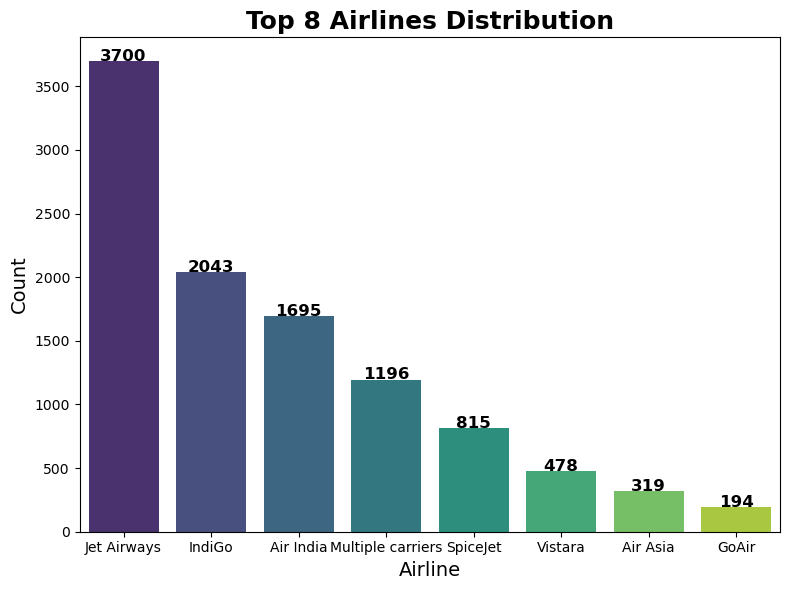
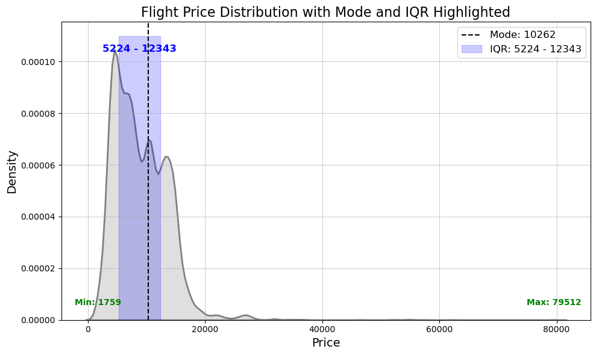
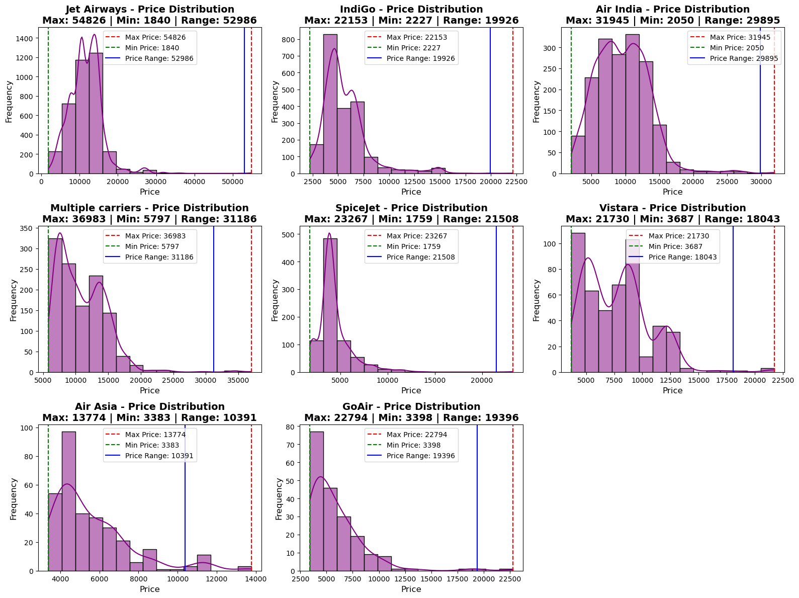
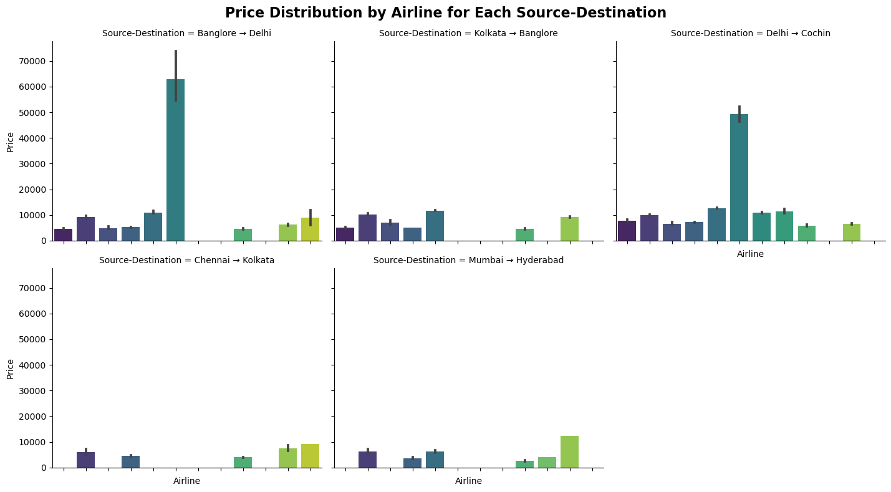

# ✈️ Airline Ticket Pricing Prediction Using Machine Learning


## Project Overview
The **Airline Ticket Pricing Prediction** project leverages machine learning techniques to forecast ticket prices based on multiple factors like airlines, journey dates, and routes. This tool assists travelers in finding the best deals and helps airlines optimize pricing strategies to maximize revenue.

---

## 👉 Introduction
Airline ticket prices are dynamic, influenced by factors like demand, seasonality, and route popularity. Predicting prices is a complex challenge but provides immense value for both passengers and airlines. This project uses data-driven machine learning techniques to predict ticket prices accurately and generate actionable insights.

---

## 👉 Problem Statement
Airline ticket prices fluctuate due to various factors, including demand, time of booking, and seasonality, making price forecasting challenging. Traditional methods fail to capture these dynamics effectively. This project provides a robust machine learning model that empowers users with accurate price predictions and helps airlines refine their pricing strategies.

---

## 👉 Dataset Description
The dataset includes historical airline ticket pricing information with the following attributes:

- **Airline**: Name of the airline (e.g., IndiGo, Air India, SpiceJet).
- **Date_of_Journey**: Date of the journey.
- **Source**: Departure city (e.g., Delhi, Mumbai).
- **Destination**: Arrival city.
- **Route**: The route taken (e.g., BLR → DEL).
- **Dep_Time**: Flight departure time.
- **Arrival_Time**: Flight arrival time.
- **Duration**: Total flight duration.
- **Total_Stops**: Number of stops in the journey.
- **Additional_Info**: Extra details about the flight (e.g., in-flight meals, baggage allowance).
- **Price**: Ticket price (target variable for prediction).

---

## 👉 Features
The following features are utilized to train the machine learning models:

- **Airline**: Categorical feature representing different airlines.
- **Source & Destination**: Departure and arrival cities (categorical features).
- **Journey Day & Month**: Extracted from the date of the journey.
- **Departure & Arrival Times**: Split into hour and minute for analysis.
- **Duration**: Numerical feature representing the total time of the flight.
- **Total Stops**: Indicates the number of stops (categorical).

---

## 👉 Installation

To get started, clone this repository and install the required dependencies:

```bash
git clone https://github.com/Prajwalpatelp/Airline_Price_Predicition_Project.git

cd  Airline_Price_Predicition_Project

pip install -r requirements.txt
```

---

## 👉 Machine Learning Models

The project employs multiple machine learning algorithms to enhance prediction accuracy:

- **Linear Regression**
- **Ridge Regression**
- **Lasso Regression**
- **Random Forest Regressor**
- **Gradient Boosting Regressor**
- **XGBoost Regressor**
- **Decision Tree Regressor**
- **AdaBoost Regressor**
- **KNeighbors Regressor**

### Metrics Used:
- **Mean Absolute Error (MAE)**
- **Mean Squared Error (MSE)**
- **R² Score**

### Hyperparameter Tuning:
- Grid search techniques are applied to optimize the performance of models.

---

## 👉 Usage

To run the application locally, execute the following command in your terminal:

```bash
streamlit run app.py
```

The Streamlit app provides an intuitive interface where users can select flight details (e.g., airline, route, stops) and get a predicted ticket price.

---

## 👉 Insights

### Graphs and Observations:

1. **Airline Distribution**:  
     
   - Airlines like IndiGo, Air India, and SpiceJet dominate the market, offering the most flights.

2. **Price Distribution**:  
     
   - Most ticket prices fall within the range of ₹5,000 to ₹15,000, with premium airlines showing greater variability.

3. **Airline vs. Price**:  
     
   - Jet Airways and Air India generally have higher ticket prices, reflecting premium services.  
   - Low-cost carriers like SpiceJet and GoAir offer budget-friendly tickets, attracting cost-conscious travelers.

4. **Price Distribution by Source and Destination**:  
     
   - Flights originating from major hubs like Delhi and Mumbai show higher price ranges.  
   - Popular tourist destinations tend to have fluctuating prices based on seasonality.

---

## 👉 Technologies Used

The following libraries and tools were used to develop this project:

### **Python Libraries**:
- Pandas, NumPy, Math
- Matplotlib, Seaborn,plotly
- Scikit-learn (for ML models)
- XGBoost

### **Metrics**:
- Mean Absolute Error (MAE)
- Mean Squared Error (MSE)
- R² Score

### **Deployment**:
- Streamlit
- Pickle (for saving trained models)

---

## 👉 Contact Information

For any questions, feedback, or suggestions, feel free to reach out:

📧 **Email**: [prajwalkumar2228@gmail.com](mailto:prajwalkumar2228@gmail.com)

---

## 👉 Conclusion

The **Airline Ticket Pricing Prediction** project demonstrates the application of machine learning in solving real-world problems. By leveraging data-driven insights, this tool provides significant value to travelers and airlines alike. Future enhancements may include real-time price predictions and integration with booking platforms.
